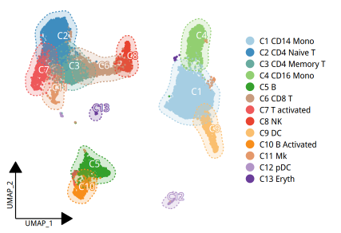
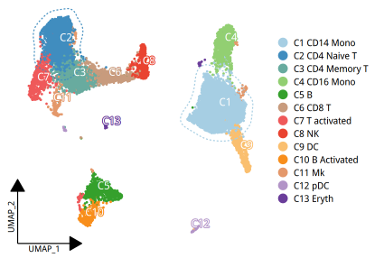
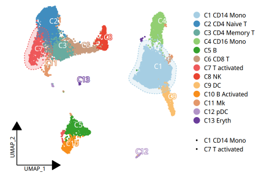
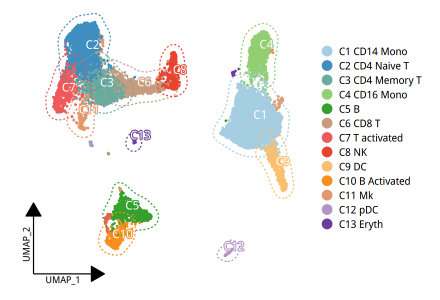
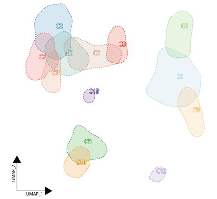
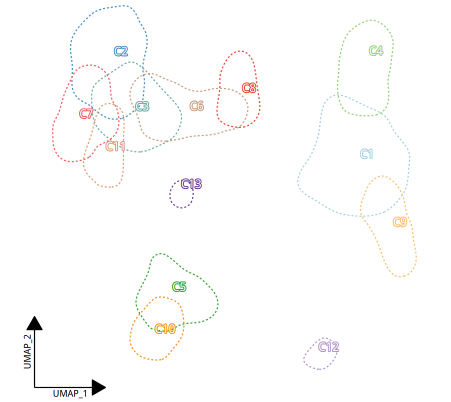
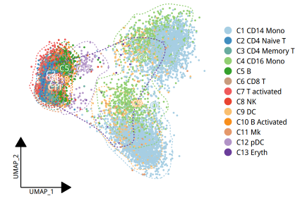

# scanno
# install

```R
install.packages(c('Seurat', 'dplyr', 'ggplot2', 'RColorBrewer'))

# install.packages("devtools")
devtools::install_github("sajuukLyu/ggunchull", type = "source")
install.packages("ggh4x")
install.packages("shadowtext")
```

```R
devtools::install_github('seqyuan/annnosc')
```

# example
现在只有一个画降维图的函数`plot_dim`，后续根据需求更新集成发表级函数。

```R
library(annosc)
library(ggplot2)
library(Seurat)
library(dplyr)
```

```R
rds <- readRDS('ifnb.rds')
Idents(rds) <- rds@meta.data$seurat_annotations
```

```R
plot_dim(rds, fill=TRUE)
```



```R
plot_dim(rds, fill=NA, show.cls=c("CD4 Naive T", "CD14 Mono"))
```



```R
plot_dim(rds, fill=TRUE, show.cls=c("T activated", "CD14 Mono"))
```



```R
plot_dim(rds, fill=NA)
```



```R
plot_dim(rds, fill=TRUE, show.pt=FALSE)
```



```R
plot_dim(rds, fill=NA, show.pt=FALSE)
```



```R
plot_dim(rds, reduction="pca")
```



